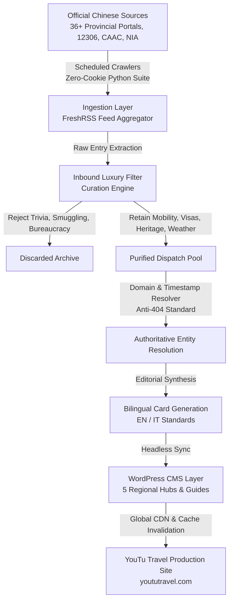

# System Architecture & Pipeline Implementation

This document describes the end-to-end architecture and operational engineering behind the **China Travel Intelligence & Editorial Pipeline**. It outlines how intelligence is ingested, filtered, transformed, and published across dual-language platforms without exposing internal server endpoints or credentials.

---

## 1. High-Level System Architecture

---

## 2. Intelligence Ingestion Layer

The ingestion tier continuously monitors official Chinese public authorities to capture first-hand operational updates before they are reported by third-party western media.

### Crawling & Monitoring Suite
- **Parallel Scrapers**: Custom Python scrapers monitor 36 provincial departments of culture and tourism, national museum ticket ticketing portals, CAAC aviation bulletins, and China State Railway Group.
- **Zero-Cookie Architecture**: Scrapers operate with dynamic user-agent cycling and header normalization to bypass anti-scraping blocks without requiring authenticated session cookies.
- **Feed Registry**: OPML-organized subscriptions structured by the 5 canonical regional hubs, enabling instant geographic routing upon ingestion.
- **Aggregator Engine**: Self-hosted FreshRSS engine running automated background actualization on an isolated scheduling loop.

---

## 3. Intelligence Purification & Curation Engine

Raw ingestion collects hundreds of daily government bulletins. The curation engine applies a strict **Inbound Luxury Filter** designed specifically for high-net-worth international travelers (FITs, couples, families, and private itineraries).

### Positive Retention Criteria
1. **Heritage & Imperial Access**: UNESCO World Heritage sites (Forbidden City, Terracotta Army, Dunhuang Mogao Caves, Sanxingdui), foreign passport booking window changes, preservation closures.
2. **Alpine & Scenic Operational Advisories**: Severe weather disruption (Changbaishan Heavenly Lake, Huangshan cable cars, Jiuzhaigou eco-capacity caps).
3. **Cross-Regional Mobility & Transit**: High-Speed Rail (HSR) schedule modifications, direct tourist lines, new international airport terminals.
4. **Immigration & Entry Frameworks**: Bilateral visa exemption agreements, 144-Hour TWOV (Transit Without Visa) scope changes, mobile payment integrations (Alipay/WeChat Pay foreign card binding).
5. **Aesthetic & Seasonal Phenology**: Prime seasonal alerts (first snowfall over imperial landmarks, peak foliage, blooming calendars).

### Negative Blacklist (Zero Tolerance)
- Petty contraband/smuggling seizures at customs border crossings.
- Domestic sentimental transit trivia ("lost item returned to passenger").
- Local suburban sports and county-level marathons.
- Resident-only discounts, municipal bus vouchers, domestic university vacation dates.
- Routine administrative meetings and internal governmental conferences.

---

## 4. Editorial & Publishing Engine

### Anti-404 Source Linking Standard
Traditional social media post URLs (such as Weibo single-post status links) enforce login walls (SSO) and serve HTTP 404 or visitor redirections to overseas IP addresses. Dynamic government CMS subpages frequently suffer from permalink rot or domestic firewalls (WAF HTTP 412/521).

- **Standard**: All dispatches strictly link to verified official organization profile homepages (`https://weibo.com/u/<UID>`) or official government root domains.
- **Anchor Text Conventions**:
  - English: `[Authority Name] (Sina Weibo)` or `[Authority Name] (Official Portal)`
  - Italian: `[Nome Autorità] (Sina Weibo)` or `[Nome Autorità] (Portale Ufficiale)`

### Authentic CST Timestamping
- Cards display genuine publication timestamps in China Standard Time (`HH:MM CST`).
- Verification banners are marked as `Daily Purified`.

---

## 5. CMS & Production Layer

The content layer lives on WordPress, serving both English and Italian audiences:
- **Headless & CLI Management**: Automated content synchronization using WP-CLI and REST APIs.
- **Caching & Delivery**: Reverse proxy caching with instant cache invalidation upon batch updates.
- **Dual-Language Synchronization**: Strict pairing between English and Italian hubs to maintain parity across regional coverage.
